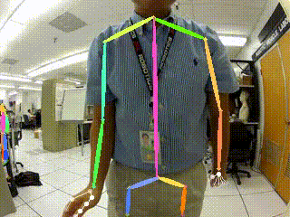
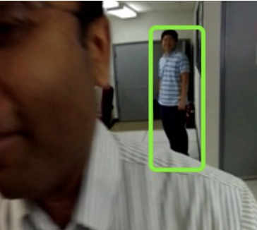
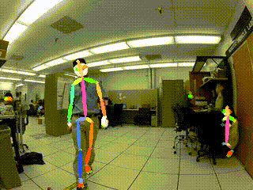
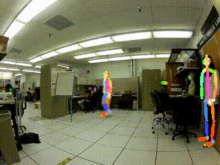
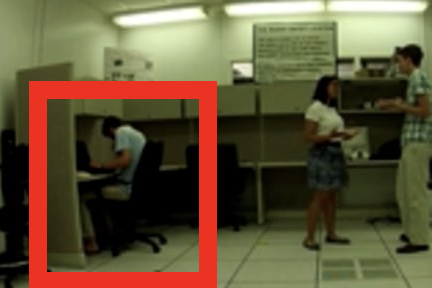

# SocialEgoNet

This is the official repo for the ICME2025 paper [Interact with me: joint prediction of self-centred interaction intentions, attitudes and social actions](https://arxiv.org/abs/2412.16698).

[](https://arxiv.org/abs/2412.16698)

Abstract:

For efficient human-agent interaction, an agent should proactively recognize their target user and prepare for upcoming interactions. We formulate this challenging problem as the novel task of jointly forecasting a person's intent to interact with the agent, their attitude towards the agent and the action they will perform, from the agent's (egocentric) perspective. So we propose **SocialEgoNet** - a graph-based spatiotemporal framework that exploits task dependencies through a hierarchical multitask learning approach. SocialEgoNet uses whole-body skeletons (keypoints from face, hands and body) extracted from only 1 second of video input for high inference speed. For evaluation, we augment an existing egocentric human-agent interaction dataset with new class labels and bounding box annotations. Extensive experiments on this augmented dataset, named JPL-Social, demonstrate **real-time** inference and superior performance (average accuracy across all tasks: 83.15\%) of our model outperforming several competitive baselines. The additional annotations and code will be available upon acceptance.

<div align="center">
    
    
    
<div align="center">
    Positive (handshake, hug, pet and wave)
</div>
</div>

# JPL-P4S
This dataset is based on the [JPL First-Person Interaction dataset (JPL-Interaction dataset)](http://michaelryoo.com/jpl-interaction.html) and it aims to understand and analyse coherent social interaction attitudes and actions from an egocentric perspective using pose features. Specifically, this dataset has the whole-body key points of people in videos getting from [AlphaPose](https://github.com/MVIG-SJTU/AlphaPose/blob/master/README.md), including body, face and hand, and the corresponding attitude and action classes of the actors. Social actions are often an expression of social attitudes. In analysing them, so we set social actions as subcategories of social attitudes, as positive (handshake, hug, pet and wave), neutral (point-converse and interested), negative (punch and throw) and uninterested (uninterested). In parentheses are categories of social actions.

<div align="center">
    
    
    
    
<div align="center">
    Positive (handshake, hug, pet and wave)
</div>
</div>
    
<div align="center">
    
    
<div align="center">
    Neutral (point-converse and interested)
</div>
</div>

<div align="center">
    
    
<div align="center">
    Negative (punch and throw)
</div>
</div>

<div align="center">
    
<div align="center">
    Uninterested (uninterested)
</div>
</div>

# Contribution
## 1. Extraction of Whole-Body Pose Features
This dataset uses AlphaPose's model to extract whole-body pose features of the actors in the JPL video dataset. The obtained pose features include body, face and hand features. The pose key points include two annotation criteria, [COCO-WholeBody](https://github.com/jin-s13/COCO-WholeBody) and [Halpe136](https://github.com/Fang-Haoshu/Halpe-FullBody). AlphaPose gets better performance on COCO-WholeBody (check the [link](https://github.com/MVIG-SJTU/AlphaPose/blob/master/docs/MODEL_ZOO.md) for details). While halpe136 adds 3 important key points which are head, neck and hip.

<div align="center">
    <br>
    An exmaple of COCO-WholeBody key points
</div>

<div align="center">
    <br>
    An exmaple of Halpe136 key points
</div>

## 2. Data Augmentation
This dataset uses frame-based and feature-based data augmentation methods.

The [crop](crop/) dataset uses the frame-based data augmentation method. The frame is cropped and flipped several times according to different rates, and then AlphaPose is used to obtain the pose features. The cropping rates are [95%, 85%, 75%], and 3 random crops are made at each rate. The amount of video is augmented 20 times after flipping. Cropping can crop out key points of the actor's part away from the body centre, increasing data richness and complexity. The cropped video can be downloaded [here](https://drive.google.com/file/d/1cqbWc3Lef0QbYaD9zEMaOEXmRGr3dmaO/view?usp=drive_link) and the original AlphaPose outputs are in [alphapose-result](crop/alphapose_result).

The [noise](noise/) dataset uese the feature-based data augmentation method i.e., adding Gaussian noise to the key points coordinates, `x` and `y` respectively, obtained from AlphaPose and flipping them directly. To make the added noise adaptive to actors with different distances from the camera, the standard deviation `σ` of the Gaussian noise is based on the size of the bounding box and a noise generation rate `r`. Specifically, $σ_{x} =width_{bbox}\times r$ and $σ_{y} =height_{bbox}\times r$. `r` is selected from [1%, 0.5%, 0.1%], and noise is added 3 times at each rate. So the number of samples augments 20 times after flipping.

We also mix two data augmentation methods to investigate the possibility of complementarity between the two methods and the impact of generating more data on the model. Thus, there are two mixed augmented datasets. The [mixed_same](mixed/same) dataset was first augmented using the frame-based method (cropping rates selected from [85%, 75%] and randomly cropped twice), then horizontal flipping, and using the feature-based method (noise generation rate `r` = 0.5% and adding Gaussian noise once). The number of samples after augmentation is also 20 times larger than before, which is consistent with the first two augmentation methods. The [mixed_large](mixed/large) dataset adds Gaussian noise to the frame-based augmentation dataset (noise generation rate `r` is selected from [1%, 0.5%], and noise is added twice), and the number of samples after augmentation is 100 times larger than before.

The distribution of the samples across the social attitude and social action categories is shown in the table below. The different augmentation methods and pose formats do not vary much on this, so only the [crop_coco-wholebody](crop/coco_wholebody) subset is shown.

|                                                               | Number of Samples | Average Frame Number |
|---------------------------------------------------------------|-------------------|----------------------|
|**_Positive (Attitude_Class_id: 0)_**                          |**_960_**          |**_176.91_**          |
| \|- Handshake (Action_Class_id: 0)                            | \|- 240           | \|- 177.07           | 
| \|- Hug (Action_Class_id: 1)                                  | \|- 240           | \|- 163.96           | 
| \|- Pet (Action_Class_id: 2)                                  | \|- 240           | \|- 235.72           | 
| \|- Wave (Action_Class_id: 3)                                 | \|- 240           | \|- 249.62           |
|**_Neutral (Attitude_Class_id: 1)_**                           |**_939_**          |**_358.64_**          |
| \|- Point-converse (Action_Class_id: 4)                       | \|- 460           | \|- 616.65           | 
| \|- Interested (Action_Class_id: 8)                           | \|- 479           | \|- 110.86           |
|**_Negative (Attitude_Class_id: 2)_**                          |**_480_**          |**_86.25_**           |
| \|- Punch (Action_Class_id: 5)                                | \|- 240           | \|- 44.47            | 
| \|- Throw (Action_Class_id: 6)                                | \|- 240           | \|- 128.03           | 
|**_Uninterested (Attitude_Class_id: 3, Action_Class_id: 7)_**  |**_1405_**         |**_87.71_**           | 

(The original video's fps is 30)


## 3. Data Labelling
In JPL-interaction videos, there are often other people in the frame besides the actor. Some of them focus on the interaction and some do not. Therefore, in addition to the seven social actions that JPL-Interaction focuses on, two more action classes are added to this dataset, "not interested" and "interested". In this case, the database can also be used for the social attitude analysis. In addition, when identifying each person in a video, YOLOv3 used by AlphaPose may lose track, i.e., the same person may have different person IDs in different frames. This phenomenon is more pronounced in jittery videos. In the labelling work, it is also necessary to merge the pose feature sequences of the same person in different frames.

# Metadata
Schema of json files
```
{
  "video_name": Name of the video this person is in (string),
  "frame_size": [width of the frame (integer), height of the frame (integer)] (array),
  "video_frames_number": Number of video frames,
  "detected_frames_number": Number of frames the person is detected by Alphapose,
  "person_id": Id of this person in the video (integer),
  "attitude_class": attitude id of this person (integer),
  "action_class": action id of this person (integer),
  "frames": [{
      "frame_id": Id of video frame (Integer),
      "key points": [[x (float), y (float), score (float)], ..., [x, y, score]] (array),
      "score": Confidence score of this person this frame (float),
      "box": [x (float), y (float), width (float), height (float)] - bounding box information,
      },
      ...,
      {...}
      ]
}
```
The number and order of key points per frame corresponds to [COCO-WholeBody](https://github.com/jin-s13/COCO-WholeBody) and [Halpe136](https://github.com/Fang-Haoshu/Halpe-FullBody).

# Repository Structure
```
.
├── crop
│   ├── alphapose_result
│   │   ├── coco_wholebody
│   │   │   ├── 1680 json files of pose features (5.56 GB)
│   │   ├── halpe136
│   │   │   ├── 1680 json files of pose features (5.71 GB)
│   ├── coco_wholebody
│   │   ├── 3515 json files of pose features (5.35 GB)
│   ├── halpe136
│   │   ├── 3504 json files of pose features (5.49 GB)
├── noise
│   ├── coco_wholebody
│   │   ├── 3720 json files of pose features (5.64 GB)
│   ├── halpe136
│   │   ├── 3680 json files of pose features (5.80 GB)
├── mixed
│   ├── same
│   │   ├── coco_wholebody
|   |   |   ├── 3680 json files of pose features (5.80 GB)
│   │   ├── halpe136
|   |   |   ├── 3680 json files of pose features (5.80 GB)
│   ├── large
│   │   ├── coco_wholebody
|   |   |   ├── 3680 json files of pose features (5.80 GB)
│   │   ├── halpe136
|   |   |   ├── 3680 json files of pose features (5.80 GB)
├── docs
├── README.md
```
