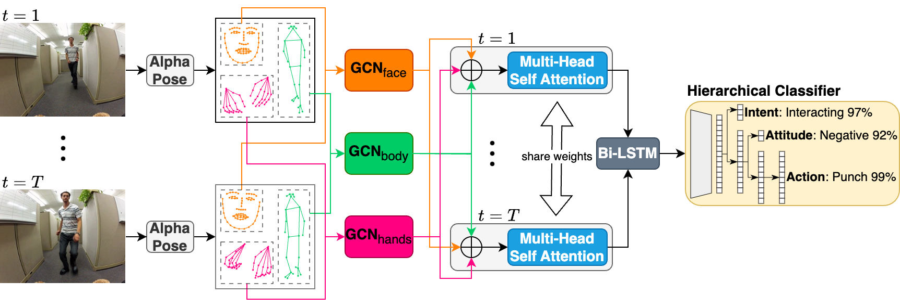
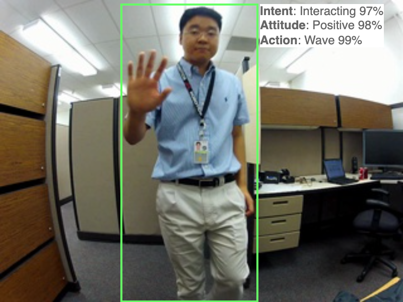
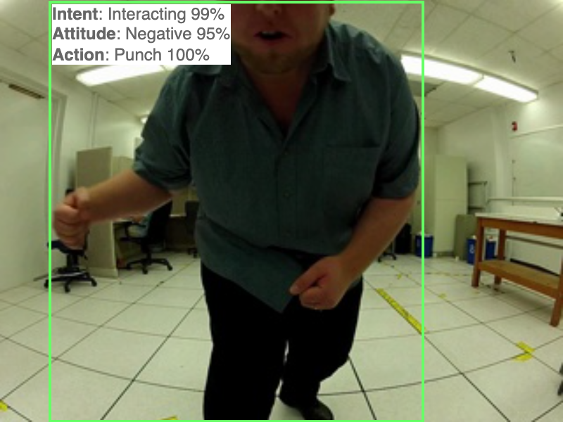
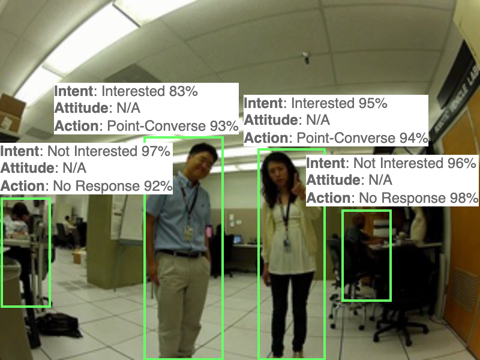

# SocialEgoNet

This is the official repo for the ICME2025 paper: 

[Interact with me: joint prediction of self-centred interaction intentions, attitudes and social actions](https://arxiv.org/abs/2412.16698) [](https://arxiv.org/abs/2412.16698)

<div align="center">
    
</div>

Abstract:
For efficient human-agent interaction, an agent should proactively recognize their target user and prepare for upcoming interactions. We formulate this challenging problem as the novel task of jointly forecasting a person's intent to interact with the agent, their attitude towards the agent and the action they will perform, from the agent's (egocentric) perspective. So we propose **SocialEgoNet** - a graph-based spatiotemporal framework that exploits task dependencies through a hierarchical multitask learning approach. SocialEgoNet uses whole-body skeletons (keypoints from face, hands and body) extracted from only 1 second of video input for high inference speed. For evaluation, we augment an existing egocentric human-agent interaction dataset with new class labels and bounding box annotations. Extensive experiments on this augmented dataset, named JPL-Social, demonstrate **real-time** inference and superior performance (average accuracy across all tasks: 83.15\%) of our model outperforming several competitive baselines. The additional annotations and code will be available upon acceptance.

<div align="center">
    
    
    
<div align="center">
    The intent-to-interact task forecasts whether a person in the field of view is interacting, interested or not interested. 
    Attitude towards agent is either positive or negative. 
    The action task anticipates which action the person is going to perform.
</div>
</div>

## Result
|                        | Params (M) | Latency (ms) | Intent_F1 | Attitude_F1 | Action_F1 |
|------------------------|------------|--------------|-----------|-------------|-----------|
|R3D-18 [1]              | 33.17      | 8.67         | 75.14     | 70.02       | 46.61     |
|ST-GCN [2]              | 9.42       | Δ + 1.40     | 87.30     | 87.84       | 65.19     |
|DG-STGCN [3]            | 8.78       | Δ + 3.47     | 83.92     | 84.34       | 67.18     |
|MS-G3D [4]              | 12.82      | Δ + 4.74     | 90.02     | 90.11       | 73.29     |
|**SocialEgoNet (ours)** | 3.18       | Δ + 0.56     | 88.43     | 88.99       | 69.57     |

Δ refers to the time to extract the whole-body pose keypoints. In our case, [AlphaPose](https://github.com/MVIG-SJTU/AlphaPose) takes 1.27 ms to extract whole-body pose features from an annotated frame.

## Data
This dataset used in the paper, JPL-Social, is based on the [JPL First-Person Interaction dataset (JPL-Interaction dataset)](http://michaelryoo.com/jpl-interaction.html). JPL-Social has the whole-body key points of people in videos getting from [AlphaPose](https://github.com/MVIG-SJTU/AlphaPose), including body, face and hand, and the additional social intention attitude and action classes of each person in videos. JPL-Social can be downloaded from [here](https://drive.google.com/file/d/1gpH_T60e99cR_x4C5B2YKvPPa99rBzic/view?usp=drive_link).

Metadata
```
{
  "video_name": Name of the video this person is in (string),
  "frame_size": [width of the frame (integer), height of the frame (integer)] (array),
  "video_frames_number": Number of video frames,
  "detected_frames_number": Number of frames the person is detected by Alphapose,
  "person_id": Id of this person in the video (integer),
  "attitude_class": attitude id of this person (integer),
  "action_class": action id of this person (integer),
  "frames": [{
      "frame_id": Id of video frame (Integer),
      "key points": [[x (float), y (float), score (float)], ..., [x, y, score]] (array),
      "score": Confidence score of this person this frame (float),
      "box": [x (float), y (float), width (float), height (float)] - bounding box information,
      },
      ...,
      ]
}
```

## Train and Test

To train and test SocialEgoNet on JPL-Social, you need download the data and save it under the current project path.

To train a new SocialEgoNet, run
```
python scripts/train.py --cfg config/train.yaml
```

To test the pretrained weights on JPL-Social, run
```
python scripts/test.py --cfg config/test.yaml --check_point weights/socialegonet_jpl.pt
```

## Citation
Please cite the following paper if you use this repository in your reseach.
```
@INPROCEEDINGS{bian2024interact,
  author={Bian, Tongfei and Ma, Yiming and Chollet, Mathieu and Sanchez, Victor and Guha, Tanaya},
  booktitle={2025 IEEE International Conference on Multimedia and Expo (ICME)}, 
  title={Interact with me: Joint Egocentric Forecasting of Intent to Interact, Attitude and Social Actions}, 
  year={2024}
}
```

## Refrences 
```
[1] Du Tran, Heng Wang, Lorenzo Torresani, Jamie Ray, Yann LeCun, and Manohar Paluri, “A closer look at spatiotemporal convolutions for action recognition,” in Proceedings of the IEEE conference on Computer Vision and Pattern Recognition, 2018, pp. 6450–6459. 2, 4, 5
[2] Sijie Yan, Yuanjun Xiong, and Dahua Lin, “Spatial temporal graph convolutional networks for skeleton-based action recognition,” in Proceedings of the AAAI conference on artificial intelligence, 2018, vol. 32. 2, 4, 5
[3] Haodong Duan, Jiaqi Wang, Kai Chen, and Dahua Lin, “Dg-stgcn: Dynamic spatial-temporal modeling for skeleton-based action recognition,”arXiv preprint arXiv:2210.05895, 2022. 4, 5
[4] Ziyu Liu, Hongwen Zhang, Zhenghao Chen, Zhiyong Wang, and Wanli Ouyang, “Disentangling and unifying graph convolutions for skeleton-based action recognition,” in Proceedings of the IEEE/CVF Conference on Computer Vision and Pattern Recognition (CVPR), June 2020. 4, 5
```
